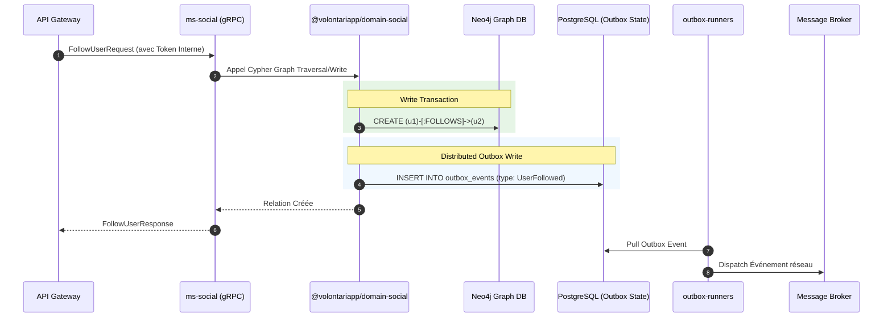

# Architecture & Design Document (ms-social & domain-social)

## Architecture Overview

Le microservice `ms-social` s'intègre dans le modèle standardisé de Volontariapp (NestJS, gRPC, DDD partagé en paquet NPM). Son originalité majeure réside dans l'utilisation de **Neo4j** comme solution de stockage primaire. Les entités métier du composant `@volontariapp/domain-social` se mappent donc sur des Nœuds (Nodes) et des Arêtes (Edges) plutôt que sur des tables relationnelles.

## Directory Structure

### 1. Structure du Microservice (`ms-social`)

```text
ms-social/
├── src/
│   ├── config/          # Variables d'environnement Neo4j et gRPC
│   ├── grpc/            # Réception et mapping des requêtes réseau (Cypher en aval)
│   ├── modules/         # Import des modules métiers via l'injection NestJS
│   └── main.ts          # Amorçage de l'application
```

### 2. Structure du Domaine Partagé (`domain-social`)

```text
npm-packages/packages/domain-social/
├── src/
│   ├── nodes/           # Entités Graph (ex: UserNode)
│   ├── relationships/   # Propriétés des arêtes (ex: FollowsRelation)
│   ├── repositories/    # Logique d'accès aux données (requêtes Cypher Neo4j)
│   └── services/        # Services métiers (Traversée, Suggester de connexions)
```

## Data Flow & Component Communication



_(Note de conception : L'écriture de la trace d'événement dans l'Outbox peut impliquer une coordination entre Neo4j et un datastore relationnel utilisé pour les runners, ou nécessiter un système Outbox adapté aux graphes)_.

## Design Decisions & Trade-offs

1. **Choix Technologique : Neo4j**
   - **Décision** : Remplacer PostgreSQL par Neo4j pour `ms-social`.
   - **Raison** : Les graphes sociaux exigent la détection rapide de cycles ou la recherche de chemin court (Friend Recommendation). Les jointures relationnelles complexes sous PostgreSQL se dégradent drastiquement à grande échelle pour ce type de requête.
   - **Compromis** : Ajoute un socle d'infrastructure asymétrique par rapport au reste de la flotte. Les ingénieurs doivent maîtriser le langage de requête Cypher.
2. **Centralisation de la Logique (`domain-social`)**
   - **Décision** : Conserver le modèle d'extraction en librairie NPM pour réutilisation dans les `post-processor-social` (ex: calculs asynchrones de suggestions d'amis ou calcul d'influence).
3. **Outbox en environnement Hybride**
   - **Décision** : Exporter les événements du domaine social via le pattern Outbox pour alerter les autres microservices de changements comportementaux.
   - **Compromis** : La gestion d'une "table" Outbox transactionnelle native sous Neo4j nécessite des approches architecturales spécifiques (noeud événementiel ou stockage polyglotte) comparé à un classique TypeORM / Postgres.
